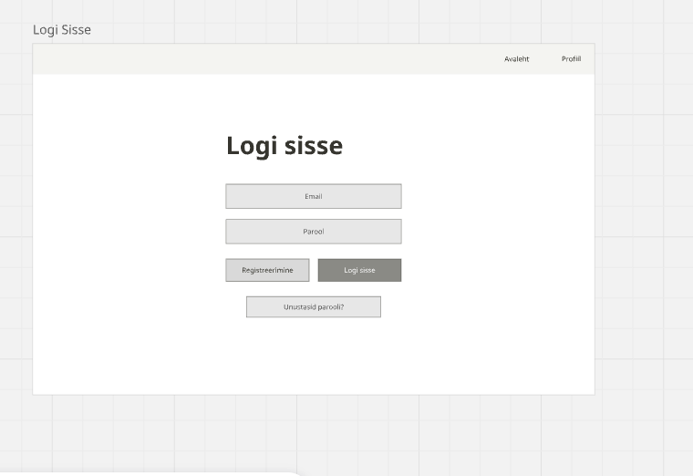
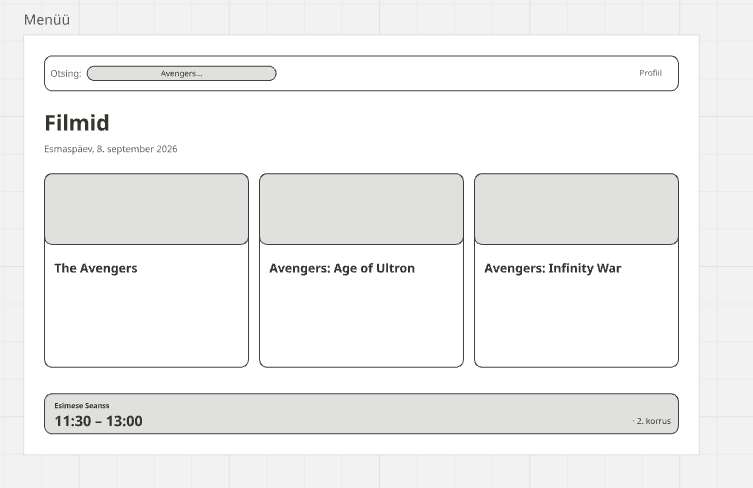

# Kinopiletid

# Mudel: Inkrementaalne.

Valisime inkrementaalse mudeli, sest teame, mida kasutajad täpselt tahavad, ning kõik projekti osad on arusaadavad ja igaüks neist täidab kindlat eesmärki.
Samuti ei ole projekt suur ega nõua suuri kulutusi.
Projekt ei kavatse lõputult laieneda.
Seetõttu ei valinud me ei spiraalset ega kosemudel.

# Inkrementaalne

Otsustasime luua ekraane inkrementaalne, kuna projektil on selged eesmärgid.

# Kinopiletid

Süsteem, mis võimaldab teil osta pileteid valitud filmile

**Tegijad:** Miron Golubev, Martin Onga · Grupp NPTV24

## Kasutajad ja nõuded
Kaks rolli: kasutaja ja haldur. Kuus kasutajalugu on Issues all,
tähtsamad on märgitud `must`.

## Arendusmudel
Me teeksime seda inkrementaalselt, sest teame, mida kasutajad täpselt tahavad, ning kõik projekti osad on arusaadavad ja igaüks neist täidab kindlat eesmärki. Samuti ei ole projekt suur ega nõua suuri kulutusi. Projekt ei kavatse lõputult laieneda. Seetõttu ei valinud me ei spiraalset ega kosemudel.

## Diagrammid
(diagrammid/Kasutusjuhtude_diagramm.png)
(diagrammid/Klassidiagramm.png)

## Makett
Valisime inkrementaalse mudeli, sest teame, mida kasutajad täpselt tahavad, ning kõik projekti osad on arusaadavad ja igaüks neist täidab kindlat eesmärki. Samuti ei ole projekt suur ega nõua suuri kulutusi. Projekt ei kavatse lõputult laieneda. Seetõttu ei valinud me ei spiraalset ega kosemudel.

## Kuidas me töötasime
Tahvel alguses ja lõpus: `protsess/board-start.png ja protsess/board-end.png `. Ekraani paigutuse väljamõtlemine oli keeruline. Probleemid, mis olid märgitud kui "Kohustuslikud", olid kergesti lahendatavad. Ekraanipaigutuse väljamõtlemine oli keeruline. „Kohustuslikuks“ märgitud probleemid olid kergesti lahendatavad. Mudel valiti välja suuremate raskusteta.
