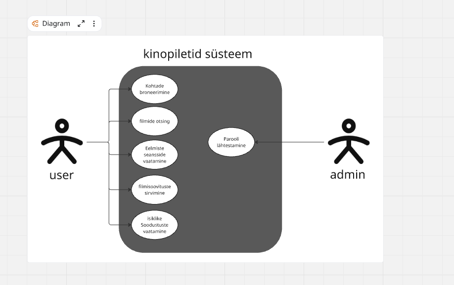
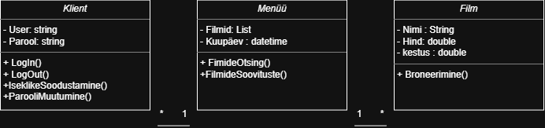
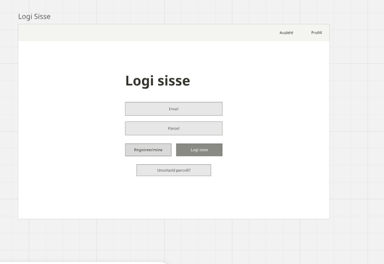
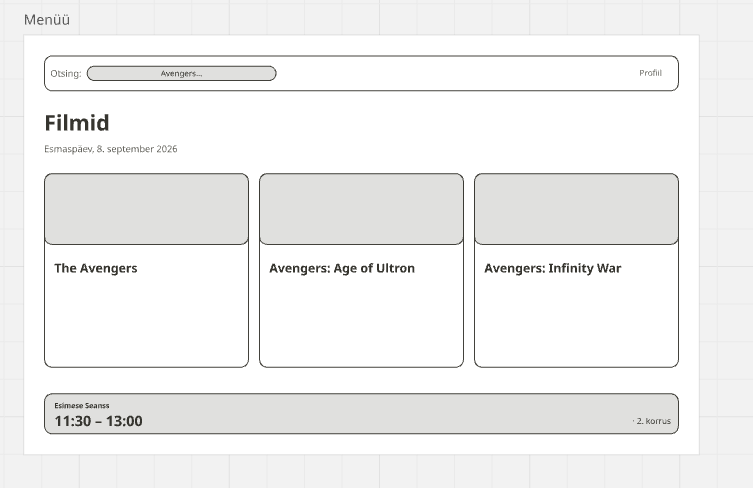
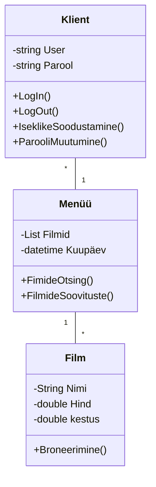
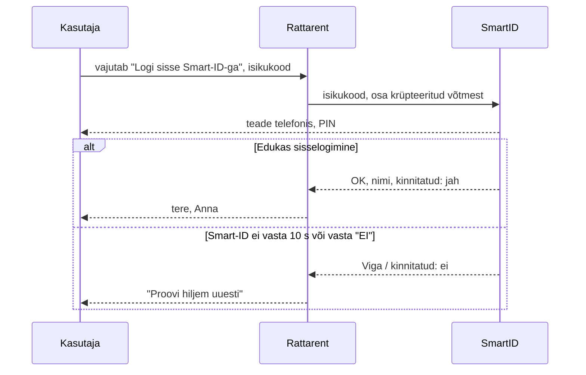

# Kinopiletid

# Mudel: Inkrementaalne.

Valisime inkrementaalse mudeli, sest teame, mida kasutajad täpselt tahavad, ning kõik projekti osad on arusaadavad ja igaüks neist täidab kindlat eesmärki.
Samuti ei ole projekt suur ega nõua suuri kulutusi.
Projekt ei kavatse lõputult laieneda.
Seetõttu ei valinud me ei spiraalset ega kosemudel.

# Inkrementaalne

Otsustasime luua ekraane inkrementaalne, kuna projektil on selged eesmärgid.

# Kinopiletid

Süsteem, mis võimaldab teil osta pileteid valitud filmile

**Tegijad:** Miron Golubev, Martin Onga · Grupp NPTV24

## Kasutajad ja nõuded
Kaks rolli: kasutaja ja haldur. Kuus kasutajalugu on Issues all,
tähtsamad on märgitud `must`.

## Arendusmudel
Me teeksime seda inkrementaalselt, sest teame, mida kasutajad täpselt tahavad, ning kõik projekti osad on arusaadavad ja igaüks neist täidab kindlat eesmärki. Samuti ei ole projekt suur ega nõua suuri kulutusi. Projekt ei kavatse lõputult laieneda. Seetõttu ei valinud me ei spiraalset ega kosemudel.

## Diagrammid

## Makett
Valisime inkrementaalse mudeli, sest teame, mida kasutajad täpselt tahavad, ning kõik projekti osad on arusaadavad ja igaüks neist täidab kindlat eesmärki. Samuti ei ole projekt suur ega nõua suuri kulutusi. Projekt ei kavatse lõputult laieneda. Seetõttu ei valinud me ei spiraalset ega kosemudel.

## Kuidas me töötasime
Tahvel alguses ja lõpus: `protsess/board-start.png ja protsess/board-end.png `. Ekraani paigutuse väljamõtlemine oli keeruline. Probleemid, mis olid märgitud kui "Kohustuslikud", olid kergesti lahendatavad. Ekraanipaigutuse väljamõtlemine oli keeruline. „Kohustuslikuks“ märgitud probleemid olid kergesti lahendatavad. Mudel valiti välja suuremate raskusteta.

# Diagramm

```mermaid
classDiagram
    class Klient {
        -string User
        -string Parool
        +LogIn()
        +LogOut()
        +IseklikeSoodustamine()
        +ParooliMuutumine()
    }

    class Menüü {
        -List Filmid
        -datetime Kuupäev
        +FimideOtsing()
        +FilmideSoovituste()
    }

    class Film {
        -String Nimi
        -double Hind
        -double kestus
        +Broneerimine()
    }

    Klient "*" -- "1" Menüü
    Menüü "1" -- "*" Film

```

```mermaid
sequenceDiagram
  Kasutaja->>Rattarent: vajutab "Logi sisse Smart-ID-ga", isikukood
  Rattarent->>SmartID: isikukood, osa krüpteeritud võtmest
  SmartID-->>Kasutaja: teade telefonis, PIN
  
  alt Edukas sisselogimine
    SmartID-->>Rattarent: OK, nimi, kinnitatud: jah
    Rattarent-->>Kasutaja: tere, Anna
  else Smart-ID ei vasta 10 s või vasta "EI"
    SmartID-->>Rattarent: Viga / kinnitatud: ei
    Rattarent-->>Kasutaja: "Proovi hiljem uuesti"
  end
```

Kui kasutaja, tahan logida sisse Smart-ID-ga, et ma ei peaks parooli meeles pidama.

Vastuvõtukriteeriumid:
- Sisselogimisekraanil on väli isikukoodi sisestamiseks ja nupp "Logi sisse Smart-ID-ga".
- Pärast õnnestunud sisselogimist suunatakse kasutaja pealehele ja ekraanil on näha tervitustekst kasutaja nimega (nt "Tere, Anna").

Kui kasutaja, tahan Smart-ID vea korral selget teadet, et ma teaksin, mida teha.

Vastuvõtukriteeriumid:
- Kui Smart-ID ei vasta 10 sekundi jooksul või kasutaja vastab "EI" (katkestab), kuvatakse ekraanile selge teade: "Proovi hiljem uuesti".
- Kasutajale jääb ekraanile võimalus logida sisse alternatiivsel viisil (näiteks parooliga).
- 
## Projekti tüübid 

### (a) Uus funktsioon: isikupärast soodustuste süsteem
- Tüüp: olemasoleva süsteemi arendus
- Mis muutub: Muuda profiiliekraani; allahindluse muutuja ilmub kliendiklassi.
- Mis jääb samaks: Menüü ja filmiklass jäävad samaks, nagu ka teised ekraanid.
- Peamine risk: Allahindluse arvutamise risk
- Esimene samm: Kaaluge allahindluse arvutamist, mis ei kahjusta teie kasumit.

### (b) Migratioon: PHP + PERL + HTML 3.2 -> Node.js + React + JS
- Tüüp: migratioon
- Mis muutub: Muudetakse kogu programmi koodi
- Mis jääb samaks: ekraanid, disain ja klassid jäävad samaks
- Peamine risk: Kõrge hind ning ka pikaajaline programmi ülekandmine
- Esimene samm: Valime, millisele platvormile me üle läheme

  Me kanname kõik üle osade kaupa. Esmalt kantakse üle profiil, kuna see on programmi väikseim osa ja selle ülekandmine ei tekita raskusi. Üle tuleb kanda järgmised klassid: menüü, filmid ja profiil.

### (c) Liidestamine: Smart-ID sisselogimine
- Tüüp: liidestamine.
- Mis muutub: Sisselogimisekraan muutub ja nüüd saate sisse logida Smart-ID kaudu.
- Mis jääb samaks: Põhiklasse ja teisi mitte-sisselogimisekraane ei tohiks puudutada.
- Peamine risk: Kasutajaandmete leke ebaõige integreerimise tõttu
- Esimene samm: Töötame struktuuri kallal, et mõista, kuidas Smart ID koodi integreerida.

Saadame: Osa krüpteeritud võtmest saadetakse Smart ID süsteemi.

Saame vastu: Saame neilt kinnituse kasutaja sisselogimise kehtivuse või kehtetuse kohta.

### Vastused küsimustele

* **Mida näitas diff pärast ümbernimetamist?**
  Diff näitas täpset tekstilist muutust: punasega oli märgitud vana klassinimi (nt `Klient`) ja rohelisega uus nimi (nt `Jalgratas` või `Kasutaja`), võimaldades täpselt näha, millist teksti reas muudeti.
* **Mida oleks näidanud diff, kui oleksite muutnud draw.io PNG-faili?**
  PNG-pildi puhul oleks diff näidanud vaid seda, et binaarfail on asendatud uuega, ilma et oleks saanud visuaalselt või tekstiliselt jälgida, millised konkreetsed klassid või seosed pildil muutusid.
* **Kumb on parem, kui kaks inimest muudavad diagrammi - ja miks?**
  Mermaid on palju parem, sest see põhineb tekstil. Tekstipõhiseid muudatusi saab Git automatiseeritult liita (merge) ja konfliktide korral rida-rea haaval lahendada, samal ajal kui kahe binaarse PNG-faili korraga muutmisel tekib lahendamatu konflikt.

## Vahendid
Meie Kinopiletid-süsteemi jaoks valime draw.io, kuna see on lihtsa kasutajaliidese ja laia ekspordivaliku tõttu mugav kasutada. Me ei vali Visual Paradigmi, kuna selle kasutajaliides ei ole intuitiivne ja enamikule kasutajatele arusaamatu. Kui meeskond oleks suurem, valiksime PlantUML-i, kuna see võimaldab diagramme mugavalt suurendada ulatuslikeks massiivideks.

## Projekti kaart

**Tellija:** Kino direktor
**Probleem:** Kliendid soovivad jätta tagasisidet otse veebilehel. Hetkel pole meil sellist süsteemi klientidele. See süsteem peaks toimima kõigi filmide puhul.
**Eesmärk:** Projekti lõppedes peaks meie veebilehe külastajate arv suurenema. 8
**Tulemus:** Kliendid saavad filme hinnata ja nende hinnanguid vaadata

**Ulatus SEES:**

Andmebaasi laiendamine, kus hakatakse säilitama filmide hinnanguid.

Võimalus anda filmidele hinnanguid.

Võimalus filtreerida tulemusi hinnangute järgi.

**Ulatus VÄLJAS:** 

Filmidele on antud hinnangud.

Kasutada allahindluste süsteemi.

Kasutada kohtade broneerimise süsteemi.

**Kolmnurk:** aeg: fikseeritud; raha/inimesed: keskmised mahud; ulatus: suur. Fikseeritud on: üks
**Rollid:** tellija — Martin; projektijuht — Miron; meeskond — Miron ja Martin; huvipooled — Miron

| Risk | Tõenäosus | Mõju | Mida teeme enne |
|---|---|---|---|
| Ebaõigete arvustuste lisamine  | 3 | 3 | Filmi saab hinnata ainult siis, kui selle jaoks on ostetud pilet |
| Hindede keskmine on vale. | 1 | 3 | Keskmise hinde korduv kontrollimine |
| Vead konkreetsetele kasutajatele suunatud soovitustes, mis tulenevad filmide hinnangute arvessevõtmisest  | 3 | 2 | Ära võta arvesse filmide üldhinnanguid |

**Edukriteerium:** Vaadab, kas klientide arv on kasvanud või mitte.
