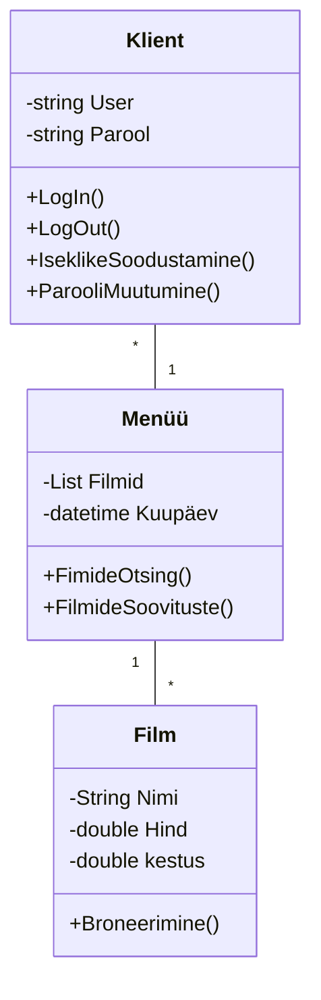

# Kinopiletid

# Mudel: Inkrementaalne.

Valisime inkrementaalse mudeli, sest teame, mida kasutajad täpselt tahavad, ning kõik projekti osad on arusaadavad ja igaüks neist täidab kindlat eesmärki.
Samuti ei ole projekt suur ega nõua suuri kulutusi.
Projekt ei kavatse lõputult laieneda.
Seetõttu ei valinud me ei spiraalset ega kosemudel.

# Inkrementaalne

Otsustasime luua ekraane inkrementaalne, kuna projektil on selged eesmärgid.

# Kinopiletid

Süsteem, mis võimaldab teil osta pileteid valitud filmile

**Tegijad:** Miron Golubev, Martin Onga · Grupp NPTV24

## Kasutajad ja nõuded
Kaks rolli: kasutaja ja haldur. Kuus kasutajalugu on Issues all,
tähtsamad on märgitud `must`.

## Arendusmudel
Me teeksime seda inkrementaalselt, sest teame, mida kasutajad täpselt tahavad, ning kõik projekti osad on arusaadavad ja igaüks neist täidab kindlat eesmärki. Samuti ei ole projekt suur ega nõua suuri kulutusi. Projekt ei kavatse lõputult laieneda. Seetõttu ei valinud me ei spiraalset ega kosemudel.

## Diagrammid

## Makett
Valisime inkrementaalse mudeli, sest teame, mida kasutajad täpselt tahavad, ning kõik projekti osad on arusaadavad ja igaüks neist täidab kindlat eesmärki. Samuti ei ole projekt suur ega nõua suuri kulutusi. Projekt ei kavatse lõputult laieneda. Seetõttu ei valinud me ei spiraalset ega kosemudel.

## Kuidas me töötasime
Tahvel alguses ja lõpus: `protsess/board-start.png ja protsess/board-end.png `. Ekraani paigutuse väljamõtlemine oli keeruline. Probleemid, mis olid märgitud kui "Kohustuslikud", olid kergesti lahendatavad. Ekraanipaigutuse väljamõtlemine oli keeruline. „Kohustuslikuks“ märgitud probleemid olid kergesti lahendatavad. Mudel valiti välja suuremate raskusteta.

# Diagramm

```mermaid
classDiagram
    class Klient {
        -string User
        -string Parool
        +LogIn()
        +LogOut()
        +IseklikeSoodustamine()
        +ParooliMuutumine()
    }

    class Menüü {
        -List Filmid
        -datetime Kuupäev
        +FimideOtsing()
        +FilmideSoovituste()
    }

    class Film {
        -String Nimi
        -double Hind
        -double kestus
        +Broneerimine()
    }

    Klient "*" -- "1" Menüü
    Menüü "1" -- "*" Film

```
## Projekti tüübid 

## 1.	Uus haru projekti-tuubid. README-sse uus jaotis ## Projekti tüübid (pärast „Diagrammid”).
2.	Iga stsenaariumi kohta viis rida, täpselt sellises vormis:
 	### (a) Uus funktsioon: <nimi>
- Tüüp: olemasoleva süsteemi arendus
- Mis muutub: <millised klassid / ekraanid / issue'd>
- Mis jääb samaks: <mida ei tohi puutuda>
- Peamine risk: <konkreetselt>
- Esimene samm: <mida teete enne, kui kirjutate rea koodi>
3.	Stsenaariumis (a) vaadake oma klassidiagrammi: millised klassid muutuvad? Kas tuleb uus klass? Kirjutage need nimeliselt.
4.	Stsenaariumis (b) otsustage: korraga või tükkhaaval? Kui tükkhaaval — mis läheb esimesena ja miks? Millised andmed peavad üle minema (loetlege tabelid / klassid)?
5.	Stsenaariumis (c) kirjutage kaks rida juurde: - Saadame: … ja - Saame vastu: ….
6.	Commit. Pull request. Teine paariline vaatab üle ja jätab ühe küsimuse iga stsenaariumi kohta (kokku 3 kommentaari), siis Approve, Merge.

### Vastused küsimustele

* **Mida näitas diff pärast ümbernimetamist?**
  Diff näitas täpset tekstilist muutust: punasega oli märgitud vana klassinimi (nt `Klient`) ja rohelisega uus nimi (nt `Jalgratas` või `Kasutaja`), võimaldades täpselt näha, millist teksti reas muudeti.
* **Mida oleks näidanud diff, kui oleksite muutnud draw.io PNG-faili?**
  PNG-pildi puhul oleks diff näidanud vaid seda, et binaarfail on asendatud uuega, ilma et oleks saanud visuaalselt või tekstiliselt jälgida, millised konkreetsed klassid või seosed pildil muutusid.
* **Kumb on parem, kui kaks inimest muudavad diagrammi - ja miks?**
  Mermaid on palju parem, sest see põhineb tekstil. Tekstipõhiseid muudatusi saab Git automatiseeritult liita (merge) ja konfliktide korral rida-rea haaval lahendada, samal ajal kui kahe binaarse PNG-faili korraga muutmisel tekib lahendamatu konflikt.

## Vahendid
Meie Kinopiletid-süsteemi jaoks valime draw.io, kuna see on lihtsa kasutajaliidese ja laia ekspordivaliku tõttu mugav kasutada. Me ei vali Visual Paradigmi, kuna selle kasutajaliides ei ole intuitiivne ja enamikule kasutajatele arusaamatu. Kui meeskond oleks suurem, valiksime PlantUML-i, kuna see võimaldab diagramme mugavalt suurendada ulatuslikeks massiivideks.

